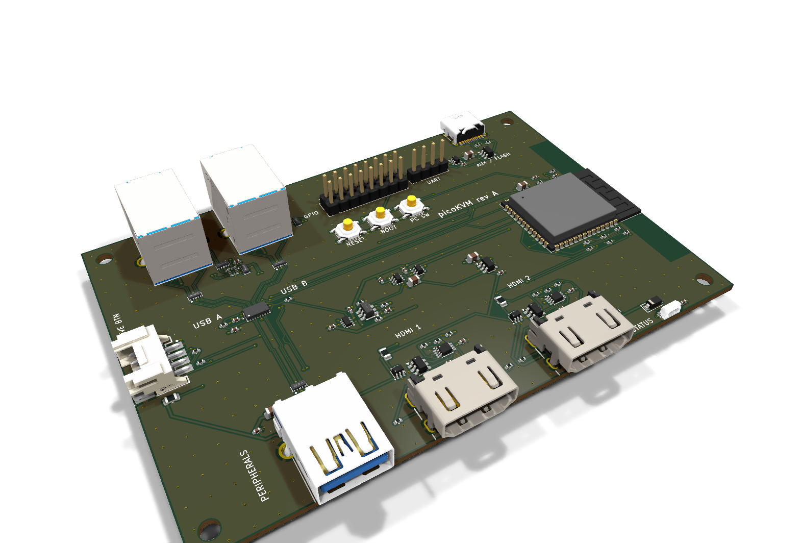
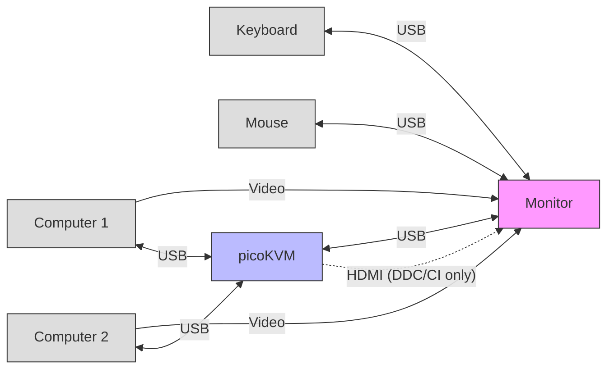

# PicoKVM
An inexpensive network KVM that can switch USB and monitor inputs simultaneously

## Why
Samsung makes great monitors, but they often lack a KVM. This project's ambition is to take advantage of the smart features of those monitors to build one with unique features.

## Features
The networking enables some unique features:
- It can control as many monitors as you can connect to your computers, as long as those can be driven over IP
- Monitor signal is not subject to any degradation, as every computer is connected directly to each monitor
- Other devices can be controlled as well - provided they can be driven by IP
    - You could for instance switch the color of a lamp - based on the selected input of the KVM
- HDCP, VRR, G-Sync, FreeSync, HDR, ... all works natively without gimmick such as EDID emulation - because every computer is directly connected to every monitor
- You can control the KVM from any device on the same network (phone, tablet, computer, ...)

## How does it works
The KVM switches the USB devices between two computers and tells the monitors to change input at the same time. Monitors can be driven over the network (Samsung remote API, SmartThings or any HTTP API) or, with the picoKVM board, directly over HDMI DDC/CI.

With the Samsung remote API, the KVM uses the Samsung remote API (https://samsungtv:8002/api/v2/) to inject key presses in order to change inputs. As on my monitors (G80SD & M70d) there is sadly no key directly mapped to inputs (like `KEY_DISPLAYPORT`, `KEY_HDMI1`). I had to build a sequence of key presses starting from the home screen. The interface is snappy enough to smoothen up this downside.

Another alternative would be to use the [SmartThings REST API](https://github.com/ollo69/ha-samsungtv-smart/issues/274#issuecomment-2597627685) - as this API allows for direct input selection. 

## Hardware setup

### picoKVM board (recommended)
A dedicated board, designed in this repository ([`hardware/`](hardware/README.md)): an ESP32-S3 module, a USB 3.0 switch (two USB-B inputs for the computers, one USB-A port for the peripherals, including peripheral power switching and current limiting), two HDMI ports carrying DDC/CI only (no video) to switch monitor inputs, an RGB status LED, and a Grove port for an [M5Stack mechanical key unit](https://shop.m5stack.com/products/mechanical-key-button-unit) used as the switch button.



`config.example.json` is set up for this board (pin map in [hardware/README.md](hardware/README.md#firmware-contract)). Connect an HDMI cable from each HDMI port to a monitor whose input should follow the KVM, and enable DDC/CI in the monitor's menu.

### M5Stack AtomS3 Lite + USB multiplexer
The original build, still supported:
- [m5stack AtomS3 Lite](https://shop.m5stack.com/products/atoms3-lite-esp32s3-dev-kit)
- [A USB multiplexer](https://thepihut.com/products/bidirectional-usb-3-multiplexer)

They need to be wired together (Ground, Signal over GPIO (`G1` by default))

You can add a physical button, I went with [this one](https://shop.m5stack.com/products/mechanical-key-button-unit). Pick a GPIO port for the LED and the button and update the config accordingly. The defaults target the picoKVM board, so set the Atom's pins and disable the board-only settings in `config.json`:
```json
"usb_gpio_pin": "G1",
"button_gpio_pin": "BUTTON",
"led_gpio_pin": "LED_RGB",
"usb_enable_gpio_pin": null,
"peripheral_power_gpio_pin": null,
"peripheral_fault_gpio_pin": null,
"vbus_sense_gpio_pins": null
```

## Software setup
For the picoKVM board, flash the MicroPython `ESP32_GENERIC_S3` firmware, **SPIRAM** variant (the module has 2 MB of PSRAM), through the AUX / FLASH USB-C port: hold BOOT, press RESET, release BOOT, then use `esptool`. That port is also the MicroPython REPL afterwards.

Clone locally this repo and copy the files of this repository (not the `hardware/` folder) to your board ([Thonny](https://thonny.org/) works great for that). On top you need to install the additional package `aiohttp` (this can be done with Thonny as well).

Copy `config.example.json` to `config.json` and adjust it with your settings. You need to configure at least your Wi-Fi credentials and the GPIO pin you connected the signal cable from the USB multiplexer to.

`config.json` is deliberately not tracked by git: the device rewrites it at runtime to persist the monitor pairing token, so it ends up holding both that token and your Wi-Fi password.

### Settings

Defaults are the picoKVM board's pins (as in `config.example.json`).

| key | what |
|---|---|
| `usb_gpio_pin` | USB select output: low = input `A`, high = input `B` |
| `button_gpio_pin` | switch button, active low |
| `led_gpio_pin` | SK6812/WS2812 data pin, or a list of pins (board: on-board LED and Grove key LED) |
| `led_idle_brightness` | `0`: LEDs off after a switch; `0` to `1`: keep showing the active input's color at that brightness |
| `usb_enable_gpio_pin` | board only: enables the USB data switches (active low, off until the firmware starts) |
| `peripheral_power_gpio_pin` | board only: peripheral port power; cycled on each switch so the peripheral re-enumerates on the new computer |
| `peripheral_fault_gpio_pin` | board only: peripheral over-current / over-temperature flag (reported in `/metrics`) |
| `vbus_sense_gpio_pins` | board only: `{"A": pin, "B": pin}`, high while that computer powers its USB port (reported in `/metrics`) |

Then, you need to configure your monitor. On the picoKVM board, DDC/CI (below) needs no network. Otherwise, either make sure that IP remote is enabled *(Connection > Network > Expert Settings)* or configure SmartThings

### DDC/CI (picoKVM board)
Each HDMI port of the board is a `DdcMonitor` device: `sda_gpio_pin` / `scl_gpio_pin` are `1` / `2` for HDMI 1 and `4` / `5` for HDMI 2. `inputs` maps `A` and `B` to the VESA MCCS value of the monitor's input source (VCP `0x60`): commonly `15` (DisplayPort 1), `16` (DisplayPort 2), `17` (HDMI 1), `18` (HDMI 2). Some monitors use their own values: read VCP `0x60` with a DDC tool (`ddcutil getvcp 60` on Linux, *ControlMyMonitor* on Windows) while each input is active. `power_on` also sends power-on (VCP `0xD6`) first, for monitors that keep DDC/CI alive in standby.

```json
{
    "data": {
        "sda_gpio_pin": 1,
        "scl_gpio_pin": 2,
        "inputs": {"A": 15, "B": 17},
        "power_on": false
    },
    "type": "DdcMonitor"
}
```

**The monitor must accept DDC/CI commands on an input that is not the active one.** The KVM's HDMI cable is only a control link: the monitor is showing a computer on another input when the command arrives, so DDC/CI has to stay enabled and responsive on inactive inputs. Most monitors with a DDC/CI setting do this, but check yours (e.g. with a laptop plugged into a spare input and `ddcutil`/ControlMyMonitor).

This has been successfully tested so far on **AOC, Samsung, Dell, Acer and Lenovo** monitors. Not every monitor implements DDC/CI (the Samsung G80SD does not); use one of the network APIs below for those.

### Samsung Remote API
Using your remote, find a repeatable pattern of key presses that will allow you to select the correct input. Then, using the [key code reference](https://github.com/ollo69/ha-samsungtv-smart/blob/master/docs/Key_codes.md), adjust `config.json` accordingly.

The pattern will be different for every input (`A` & `B`).

### Example:
```json
"command_sequences": {
    "A": [
        {
            "command": "KEY_RETURN",
            "delay": 2.2
        },
        "KEY_SOURCE",
        {
            "command": "KEY_LEFT",
            "repeat": 10
        },
        {
            "command": "KEY_RIGHT",
            "repeat": 2
        },
        "KEY_ENTER"
    ],
    "B": [
        {
            "command": "KEY_RETURN",
            "delay": 2.2
        },
        "KEY_SOURCE",
        {
            "command": "KEY_LEFT",
            "repeat": 10
        },
        {
            "command": "KEY_RIGHT",
            "repeat": 3
        },
        "KEY_ENTER"
    ]
    }
```
You can finally fine-tune the delay between each command to make sure the interface can keep track of those (`command_delay`). Optionally, the delay for a given command can be overriden - should it be slower than the rest.

If the monitor is not powered on during an input switch, it will be automatically turned on (this is what `KEY_RETURN` is for)

### SmartThings API
I did not try it, but creating a device of type `GenericDevice` with [this payload](https://github.com/ollo69/ha-samsungtv-smart/issues/274#issuecomment-2597627685) should work fine.

### Example:
```json
{
    "data": {
        "uri": "https://api.smartthings.com/v1/devices/deviceId/commands",
        "method": "POST",
        "kwargs": {
            "A": {
                "headers": {
                    "Content-Type": "application/json",
                    "Authorization": "Bearer token"
                },
                "data": "{\"commands\":[{\"component\":\"main\",\"capability\":\"samsungvd.mediaInputSource\",\"command\":\"setInputSource\",\"arguments\":[\"Display Port\"]}]}"
            },
            "B": {
                "headers": {
                    "Content-Type": "application/json",
                    "Authorization": "Bearer token"
                },
                "data": "{\"commands\":[{\"component\":\"main\",\"capability\":\"samsungvd.mediaInputSource\",\"command\":\"setInputSource\",\"arguments\":[\"HDMI1\"]}]}"
            }
        }
    },
    "type": "GenericDevice"
}
```

### ESPHome (picoKVM board)
The board can run [ESPHome](https://esphome.io) instead of this firmware, for a native Home Assistant integration. The `picokvm` external component ([esphome/components/picokvm](esphome/components/picokvm)) covers the USB switch and the DDC/CI monitors only. It exposes them as one `select` entity: choosing an option moves the USB peripherals, power-cycling the peripheral port as the firmware does, and sends VCP 0x60 to every configured monitor. Button, LEDs and VBUS/fault sensors are stock ESPHome components, wired up in [esphome/picokvm.yaml](esphome/picokvm.yaml). Samsung and generic HTTP devices are not part of the component; drive them from Home Assistant if you need them.

```yaml
external_components:
  - source: github://FuNK3Y/picoKVM
    components: [picokvm]

select:
  - platform: picokvm
    name: Input
    options: ["PC1", "PC2"]       # Input A, input B
    monitors:
      - i2c_id: hdmi1             # i2c bus on GPIO1/GPIO2
        inputs: [0x0F, 0x11]      # VCP 0x60 value for input A, input B
      - i2c_id: hdmi2             # i2c bus on GPIO4/GPIO5
        inputs: [0x0F, 0x11]
        power_on: true            # Optional: VCP 0xD6 = on first, then the input after power_on_delay (2s)
```

The pins default to the board's (USB select GPIO8, USB enable GPIO9 active low, peripheral power GPIO10), and the selected input is restored after a reboot (`restore_value`). Builds with ESPHome 2026.9.1 (not yet run on a board); flash the first time over the AUX USB-C with `esphome run esphome/picokvm.yaml`.

## How to use
Here is how to connect everything together:
- Connect computers directly to the monitors
- Connect USB from the computers to the KVM
- Connect keyboard & mouse to a USB switch - itself connected to the KVM
- With the picoKVM board, connect its HDMI 1 / HDMI 2 ports to the monitors that should switch over DDC/CI (control only, the video still goes directly from the computers to the monitors)
    - The primary monitor should be used as a USB hub (as shown in the schema). In the case of the G80SD it retains the capability to drive the smart features of the monitor with the keyboard & mouse

### Schema

```mermaid
graph LR
    KB["Keyboard"] <--> |USB| MON
    MOUSE["Mouse"] <--> |USB| MON
    KVM <--> |USB| MON
    PC1["Computer 1"] --> |Video| MON["Monitor"]
    PC2["Computer 2"] --> |Video| MON
    PC1 <--> |USB| KVM["picoKVM"]
    PC2 <--> |USB| KVM
    KVM -.-> |"HDMI (DDC/CI only)"| MON
    style MON fill:#f9f,stroke:#333
    style KVM fill:#bbf,stroke:#333
    style KB fill:#ddd,stroke:#333
    style MOUSE fill:#ddd,stroke:#333
    style PC1 fill:#ddd,stroke:#333
    style PC2 fill:#ddd,stroke:#333
```
The dashed link is the picoKVM board's HDMI port: it carries only DDC/CI to switch the monitor's input (no video). With network-controlled monitors (Samsung remote API, SmartThings, ...) it is not needed.

On top of the physical button, there are two ways to operate the KVM. You need to know the `$hostname` of the device to connect (default value is picokvm)

### Web page
Simply connect to `http://$hostname.local` and press the only button.

### API
Issue a `POST` request to `http://$hostname.local/api/active_input/A` or `B`.

**_NOTE:_** If the input name is omitted, it will act as a toggle.

#### PowerShell example:
```powershell
Invoke-RestMethod -Method POST "http://$hostname.local/api/active_input/A"
```

### Troubleshooting
Pressing the button for more than 10 seconds will reset the device
`/metrics` provide memory related information and wifi signal strength (plus, on the picoKVM board, which computers power their USB port and the peripheral fault flag). It can be ingested by prometheus
