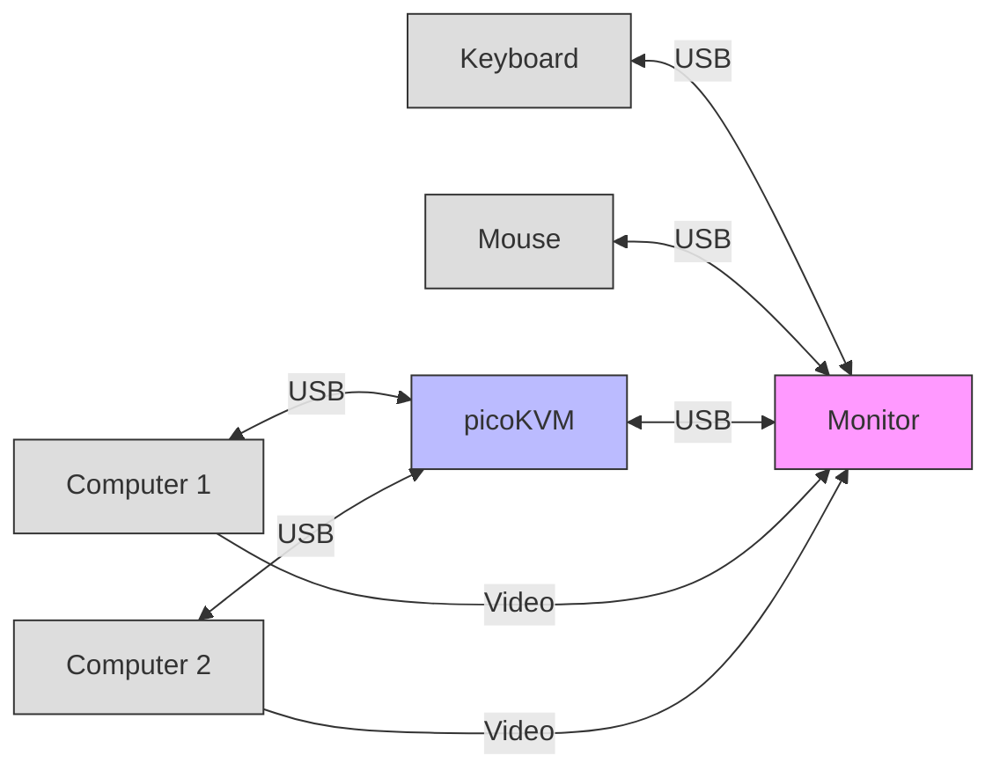

# PicoKVM
An inexpensive network KVM that can switch USB and monitor inputs simultaneously

## Why
Samsung makes great monitors, but they often lack a KVM. This project's ambition is to take advantage of the smart features of those monitors to build one with unique features.

## Features
The networking enables some unique features:
- It can control as many monitor as you can connect to your computers, as long as those can be driven over IP
- Monitor signal is not subject to any degradation, as every computer is connected directly to each monitor
- Other devices can be controlled as well - provided they can be driven by IP
    - You could for instance switch the color of a lamp - based on the selected input of the KVM
- HDCP, VRR, G-Sync, FreeSync, HDR, ... all works natively without gimmick such as EDID emulation - because every computer is directly connected to every monitor
- You can control the KVM from any device on the same network (phone, tablet, computer, ...)

## How does it works
The Atom will uses the Samsung remote API (https://samsungtv:8002/api/v2/) to inject key presses in order to change inputs. As on my monitors (G80SD & M70d) there is sadly no key directly mapped to inputs (like `KEY_DISPLAYPORT`, `KEY_HDMI1`). I had to build a sequence of key presses starting from the home screen. The interface is snappy enough to smoothen up this downside.

Another alternative would be to use the [SmartThings REST API](https://github.com/ollo69/ha-samsungtv-smart/issues/274#issuecomment-2597627685) - as this API allows for direct input selection. 

## Hardware setup
In order to get this project working you need at least the following components:
- [m5stack AtomS3 Lite](https://shop.m5stack.com/products/atoms3-lite-esp32s3-dev-kit)
- [A USB multiplexer](https://thepihut.com/products/bidirectional-usb-3-multiplexer)

They need to be wired together (Ground, Signal over GPIO (`G1` by default))

You can add a physical button, I went with [this one](https://shop.m5stack.com/products/mechanical-key-button-unit). Pick a GPIO port for the LED and the button and update the config accordingly.

## Software setup
Clone locally this repo and copy the files of this repository to your atom ([Thonny](https://thonny.org/) works great for that). On top you need to install the additional packages `aiottp`and `micropython-mdns` (this can be done with Thonny as well).

Adjust `config.json` with your settings. You need to configure at least your Wi-Fi credentials and the GPIO pin you connected the signal cable from the USB multiplexer to.

Then, you need to configure your monitor. Either make sure that IP remote is enabled *(Connection > Network > Expert Settings)* or configure SmartThings

### Samsung Remote API
Using your remote, find a repeatable pattern of key presses that will allow you to select the correct input. Then, using the [key code reference](https://github.com/ollo69/ha-samsungtv-smart/blob/master/docs/Key_codes.md), adjust `config.json` accordingly.

The pattern will be different for every input (`A` & `B`).

### Example:
```json
"command_sequences": {
    "A": [
        {
            "command": "KEY_RETURN",
            "delay": 2.2
        },
        "KEY_SOURCE",
        {
            "command": "KEY_LEFT",
            "repeat": 10
        },
        {
            "command": "KEY_RIGHT",
            "repeat": 2
        },
        "KEY_ENTER"
    ],
    "B": [
        {
            "command": "KEY_RETURN",
            "delay": 2.2
        },
        "KEY_SOURCE",
        {
            "command": "KEY_LEFT",
            "repeat": 10
        },
        {
            "command": "KEY_RIGHT",
            "repeat": 3
        },
        "KEY_ENTER"
    ]
    }
```
You can finally fine-tune the delay between each command to make sure the interface can keep track of those (`command_delay`). Optionally, the delay for a given command can be overriden - should it be slower than the rest.

If the monitor is not powered on during an input switch, it will be automatically turned on (this is what `KEY_RETURN` is for)

### SmartThings API
I did not try it, but creating a device of type `GenericDevice` with [this payload](https://github.com/ollo69/ha-samsungtv-smart/issues/274#issuecomment-2597627685) should work fine.

### Example:
```json
{
    "data": {
        "uri": "https://api.smartthings.com/v1/devices/deviceId/commands",
        "method": "POST",
        "kwargs": {
            "A": {
                "headers": {
                    "Content-Type": "application/json",
                    "Authorization": "Bearer token"
                },
                "data": "{\"commands\":[{\"component\":\"main\",\"capability\":\"samsungvd.mediaInputSource\",\"command\":\"setInputSource\",\"arguments\":[\"Display Port\"]}]}"
            },
            "B": {
                "headers": {
                    "Content-Type": "application/json",
                    "Authorization": "Bearer token"
                },
                "data": "{\"commands\":[{\"component\":\"main\",\"capability\":\"samsungvd.mediaInputSource\",\"command\":\"setInputSource\",\"arguments\":[\"HDMI1\"]}]}"
            }
        }
    },
    "type": "GenericDevice"
}
```

## How to use
Here is how to connect everything together:
- Connect computers directly to the monitors
- Connect USB from the computers to the KVM
- Connect keyboard & mouse to a USB switch - itself connected to the KVM
    - The primary monitor should be used as a USB hub (as shown in the schema). In the case of the G80SD it retains the capability to drive the smart features of the monitor with the keyboard & mouse

### Schema

On top of the physical button, there are two ways to operate the KVM. You need to know the `$hostname` of the device to connect (default value is picokvm)

### Web page
Simply connect to `http://$hostname.local` and press the only button.

### API
Issue a `POST` request to `http://$hostname.local$/api/active_input/A` or `B`.

**_NOTE:_** If the input name is omitted, it will act as a toggle.

#### PowerShell example:
```powershell
Invoke-RestMethod -Method POST "http://$hostname.local$/api/active_input/A"
```

### Troubleshooting
Pressing the button for more than 10 seconds will reset the Atom